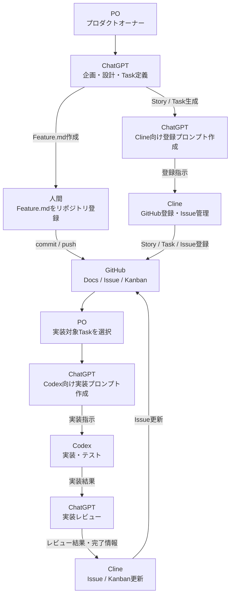
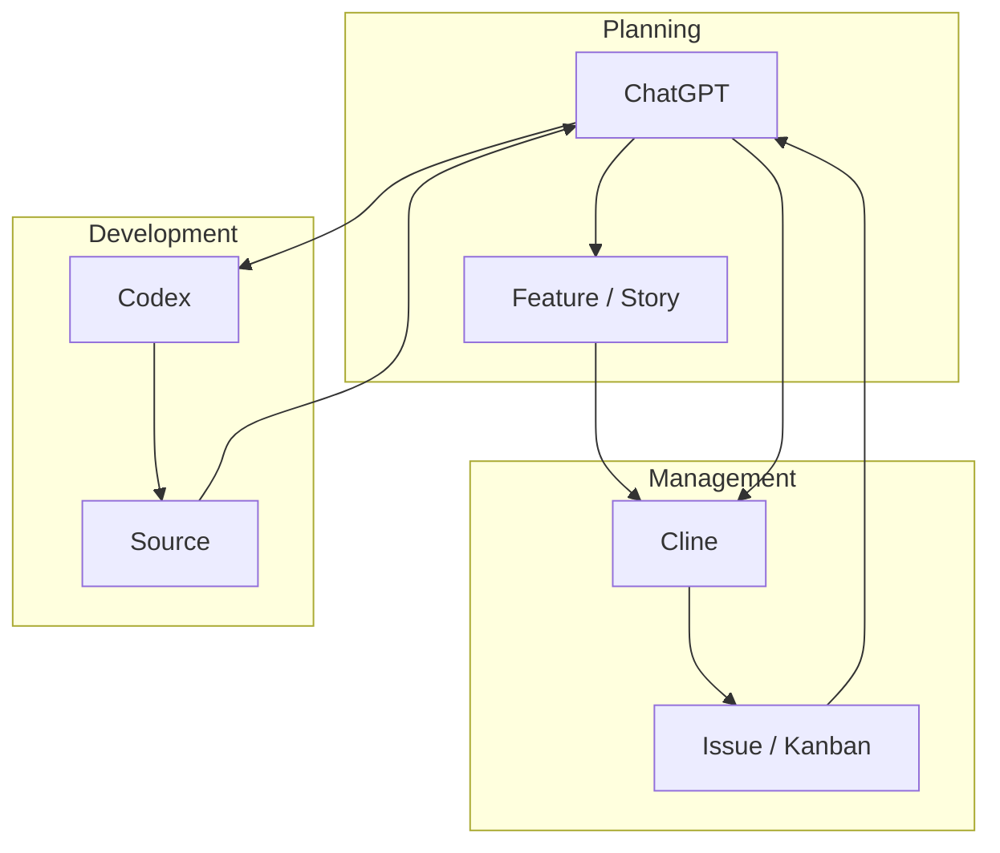

# AI開発運営体制定義

## 1. 目的

本ドキュメントは、本プロジェクトにおける生成AI活用時の運営体制およびAI間連携方式を定義する。

本プロジェクトでは複数の生成AIを利用する。

各AIの責務を明確化し、役割重複を防止するとともに、AI間で成果物を連携しながら開発を進めることを目的とする。

本ドキュメントは以下を定義する。

* AIごとの責務
* AI間の成果物連携
* GitHubの位置付け
* Product管理方式
* Task管理方式
* 実装フロー

---

# 2. 基本思想

## 2.1 人間が最終意思決定者である

生成AIは支援組織として機能する。

最終的な判断は常にプロダクトオーナーが行う。

---

## 2.2 AIごとに責務を分離する

本プロジェクトでは以下の責務分離を行う。

| AI      | 主責務              |
| ------- | ---------------- |
| ChatGPT | 企画・設計・分析・レビュー    |
| Cline   | GitHub運営・Issue管理 |
| Codex   | 実装               |
| Claude  | セカンドレビュー         |
| Gemini  | セカンドオピニオン        |

---

## 2.3 GitHubを組織の記憶とする

AIの会話履歴やメモリは正本としない。

正本はGitHub上のドキュメントとする。

```text
GitHub
 ├ Product
 ├ Maintenance
 ├ Architecture
 ├ Screen
 └ Source
```

---

# 3. AI構成

## 3.1 ChatGPT

### 役割

仮想開発組織

### 担当

* PM
* UX担当
* ソリューションアーキテクト
* 実装戦略担当
* QA担当
* 批判担当
* プロダクト分析担当
* PJM

### 主な成果物

* Vision
* Goal
* Capability
* Epic
* Feature
* Story
* 設計書
* レビュー結果
* 実装プロンプト
* Cline向けプロンプト

---

## 3.2 Cline

### 役割

GitHub運営担当

### 担当

* Issue管理
* Kanban管理
* ラベル管理
* GitHub更新
* Productバックログ管理
* Maintenanceバックログ管理

### 主な成果物

* Epic登録
* Feature登録
* Story登録
* Issue登録
* Project更新

### 方針

Clineは企画・設計を行わない。

ChatGPTが決定した内容をGitHubへ反映する。

---

## 3.3 Codex

### 役割

実装担当

### 担当

* コーディング
* リファクタリング
* テストコード作成

### 主な成果物

* ソースコード
* テストコード
* 修正内容

### 方針

Codexは設計を決定しない。

設計済み成果物に基づいて実装を行う。

---

## 3.4 Claude / Gemini

必要に応じて利用する専門AI

用途例

- セカンドレビュー
- リスク分析
- 設計妥当性評価
- 技術選定比較

---

# 4. 正本管理方針

本プロジェクトではAIの会話履歴を正本としない。

正本はGitHub上の管理情報とする。

| 管理対象 | 正本 |
|----------|------|
| Product | docs/product |
| Architecture | docs/architecture |
| Screen | docs/screen |
| Maintenance | docs/maintenance |
| Task | GitHub Issue |
| Source | Repository Source |
| Test | Repository Test |

AIは必ず正本を参照して判断すること。

---

# 5. AI間連携方式

| No | 工程        | 担当      | Input               | Output              | 次工程 |
| -- | --------- | ------- | ------------------- | ------------------- | --- |
| 1  | Product企画 | ChatGPT | 課題、要望、Vision、Goal   | Feature、Story       | 2   |
| 2  | Product登録 | PO      | Feature.md、Story.md | GitHub更新            | 3   |
| 3  | Task計画    | ChatGPT | Story、設計情報          | Task一覧、Cline向けプロンプト | 4   |
| 4  | Task登録    | Cline   | Task一覧、Cline向けプロンプト | Issue、Kanban        | 5   |
| 5  | 実装対象選定    | PO      | Issue一覧             | 対象Task              | 6   |
| 6  | 実装計画      | ChatGPT | Task、設計書、画面仕様       | Codex向けプロンプト        | 7   |
| 7  | 実装        | Codex   | 実装プロンプト、ソースコード      | ソース修正、テスト           | 8   |
| 8  | レビュー      | ChatGPT | 実装結果、差分             | レビュー結果、修正指示         | 9   |
| 9  | Issue更新   | Cline   | レビュー結果              | Issue更新、Kanban更新    | 完了  |


| 作成者     | 成果物          | 受領者     | 用途        |
| ------- | ------------ | ------- | --------- |
| ChatGPT | Feature      | PO      | Product管理 |
| ChatGPT | Story        | PO      | Product管理 |
| ChatGPT | Task一覧       | Cline   | Issue生成   |
| ChatGPT | Cline向けプロンプト | Cline   | GitHub登録  |
| ChatGPT | Codex向けプロンプト | Codex   | 実装        |
| Codex   | ソースコード       | ChatGPT | レビュー      |
| ChatGPT | レビュー結果       | Cline   | Issue更新   |
| Cline   | Issue        | PO      | 進捗管理      |

---

# 6. 標準開発フロー



---

# 7. 責務分離原則

ChatGPT

```text
考える
設計する
分析する
レビューする
```

---

Cline

```text
管理する
登録する
追跡する
```

---

Codex

```text
実装する
修正する
テストする
```



---

本プロジェクトでは、

「企画」「管理」「実装」

を異なるAIへ分離することで、品質・速度・保守性の両立を実現する。
