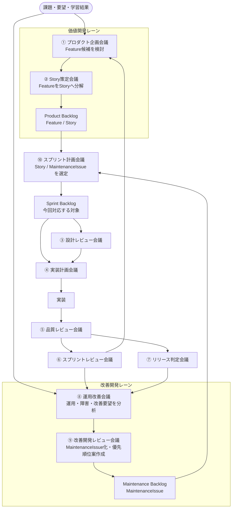

# 会議体フロー

## 1. 目的

本ドキュメントは、AI開発組織を活用した開発運営における会議体フローを定義する。

本プロジェクトでは、価値開発と改善開発を分けて管理し、それぞれのバックログからスプリント対象を選定する。

本ドキュメントは以下を定義する。

* 会議体一覧
* 会議体間の関係
* Product Backlog と Maintenance Backlog の扱い
* スプリント計画の位置付け
* 各会議体の Input / Output

---

# 2. 基本思想

## 2.1 価値開発と改善開発を分ける

本プロジェクトでは、開発対象を以下に分けて管理する。

| 区分   | 管理対象             | バックログ               |
| ---- | ---------------- | ------------------- |
| 価値開発 | Feature / Story  | Product Backlog     |
| 改善開発 | MaintenanceIssue | Maintenance Backlog |

---

## 2.2 スプリント計画で統合する

Product Backlog と Maintenance Backlog は独立して管理する。

ただし、スプリントで実施する対象は、スプリント計画会議で統合して選定する。

```text
Product Backlog
Maintenance Backlog
        ↓
スプリント計画会議
        ↓
Sprint Backlog
```

---

## 2.3 会議体は直列ではない

会議体は、①から順番にすべて実施するものではない。

価値開発、改善開発、品質評価、運用改善などの状況に応じて必要な会議体を実施する。

---

# 3. 全体フロー



---

# 4. 会議体一覧

| No | 会議体         | 主目的                                  |
| -- | ----------- | ------------------------------------ |
| ①  | プロダクト企画会議   | Feature候補を検討する                       |
| ②  | Story策定会議   | FeatureをStoryへ分解する                   |
| ③  | 設計レビュー会議    | 採択対象を設計へ落とし込む                        |
| ④  | 実装計画会議      | 実装AI向けの実装計画を作成する                     |
| ⑤  | 品質レビュー会議    | 設計品質・実装品質を評価する                       |
| ⑥  | スプリントレビュー会議 | 完成物の価値・品質・学習結果を評価する                  |
| ⑦  | リリース判定会議    | リリース可否を判断する                          |
| ⑧  | 運用改善会議      | 運用課題・障害・改善要望を分析する                    |
| ⑨  | 改善開発レビュー会議  | MaintenanceIssueを整理・評価する             |
| ⑩  | スプリント計画会議   | StoryとMaintenanceIssueからスプリント対象を選定する |

---

# 5. 会議体定義

## ① プロダクト企画会議

### 目的

ユーザー価値およびビジネス価値の観点から、Feature候補を検討する。

### 参加AI

* PM
* UX・業務設計担当
* 批判担当
* プロダクト分析担当

### Input

* Vision
* Goal
* ユーザー要望
* 市場要望
* スプリントレビュー結果
* POのアイデア

### Output

* Feature候補
* ユーザー価値
* ビジネス価値
* MVP評価
* リスク一覧

---

## ② Story策定会議

### 目的

Featureを実装可能なStoryへ分解する。

### 参加AI

* PM
* UX・業務設計担当
* 批判担当
* プロダクト分析担当

### Input

* Feature候補
* MVP対象範囲
* 優先順位方針

### Output

* Story一覧
* 受入条件
* 優先順位案
* Story依存関係
* Product Backlog登録候補

---

## ③ 設計レビュー会議

### 目的

スプリント対象として採択されたStoryまたはMaintenanceIssueを設計へ落とし込む。

### 参加AI

* PM
* UX・業務設計担当
* ソリューションアーキテクト
* 批判担当

### Input

* Sprint Backlog
* Story
* MaintenanceIssue
* 受入条件
* 業務要件
* 改善要求

### Output

* 画面設計
* 画面遷移
* API設計
* DB設計
* 業務フロー
* 設計リスク一覧

---

## ④ 実装計画会議

### 目的

実装AIへ渡す実装計画を作成する。

### 参加AI

* ソリューションアーキテクト
* 実装戦略担当
* PJM

### Input

* Sprint Backlog
* 承認済設計
* 開発方針
* コーディングルール
* Task分割方針

### Output

* 実装タスク一覧
* 実装順序
* タスク依存関係
* Codex向けプロンプト
* Copilot向けプロンプト
* Cline向けIssue登録プロンプト

---

## ⑤ 品質レビュー会議

### 目的

設計品質および実装品質を評価する。

### 参加AI

* QA担当
* 必要に応じてソリューションアーキテクト
* 必要に応じて批判担当

### Input

* ソースコード
* 設計書
* 実装結果
* テスト結果

### Output

* 設計レビュー結果
* コードレビュー結果
* テスト観点
* テストケース
* 品質リスク一覧
* MaintenanceIssue候補

---

## ⑥ スプリントレビュー会議

### 目的

完成物の価値・品質・学習結果を評価する。

### 参加AI

* PM
* QA担当
* 批判担当
* プロダクト分析担当

### Input

* 完成機能
* 完成した改善対応
* デモ結果
* 品質結果
* スプリント目標

### Output

* スプリントレビュー結果
* MVP評価
* 学習結果
* Feature候補
* Story候補
* MaintenanceIssue候補
* 次回検討事項

---

## ⑦ リリース判定会議

### 目的

本番リリース可否を判断する。

### 参加AI

* PM
* QA担当
* 運用・保守担当
* 批判担当

### Input

* 品質評価結果
* 運用設計
* リリース対象一覧
* 残課題一覧

### Output

* Go / NoGo判定
* 残リスク一覧
* 運用準備状況
* リリース条件

---

## ⑧ 運用改善会議

### 目的

運用結果、障害、問い合わせ、改善要望を分析する。

### 参加AI

* PM
* プロダクト分析担当
* 運用・保守担当
* QA担当

### Input

* 利用状況
* KPI
* 問い合わせ
* 障害情報
* 運用課題
* 改善要望

### Output

* 分析レポート
* 原因仮説
* 改善候補
* MaintenanceIssue候補
* Feature候補

---

## ⑨ 改善開発レビュー会議

### 目的

改善候補をMaintenanceIssueとして整理し、優先順位案と実施可否を検討する。

### 参加AI

* PM
* プロダクト分析担当
* ソリューションアーキテクト
* QA担当
* 運用・保守担当
* 批判担当

### Input

* 改善候補
* 障害報告
* QA指摘
* アーキテクチャレビュー結果
* 運用課題
* TechDebt候補

### Output

* MaintenanceIssue
* MaintenanceIssue種別
* 優先順位案
* 影響範囲
* 実施可否案
* Maintenance Backlog登録候補

---

## ⑩ スプリント計画会議

### 目的

Product Backlog と Maintenance Backlog から、次スプリントで対応する対象を選定する。

### 参加AI

* PM
* PJM
* プロダクト分析担当
* 批判担当
* 必要に応じてソリューションアーキテクト
* 必要に応じてQA担当

### Input

* Product Backlog
* Maintenance Backlog
* 優先順位
* 開発キャパシティ
* スプリント目標
* 依存関係
* リスク

### Output

* Sprint Backlog
* 対象Story
* 対象MaintenanceIssue
* スプリント目標
* 実施優先順位
* Task分割指示

---

# 6. Backlog管理方針

## 6.1 Product Backlog

Product Backlogでは価値開発を管理する。

対象は以下とする。

* Feature
* Story

Featureはリポジトリ内ドキュメントで管理する。

StoryはGitHub Issueで管理する。

---

## 6.2 Maintenance Backlog

Maintenance Backlogでは改善開発を管理する。

対象は以下とする。

* Bug
* TechDebt
* Refactor
* Ops
* Security

MaintenanceIssueはリポジトリ内ドキュメントで管理する。

TaskはGitHub Issueで管理する。

---

## 6.3 Sprint Backlog

Sprint Backlogでは、今回のスプリントで対応する対象を管理する。

対象は以下とする。

* Story
* MaintenanceIssue
* Task

Sprint Backlogはスプリント計画会議で確定する。

---

# 7. POの基本責務

プロダクトオーナーは、会議体において以下を実施する。

## 7.1 課題を提示する

* 何を解決したいか
* なぜ必要か
* 誰のためか
* どの制約があるか

---

## 7.2 AI会議体を招集する

対象テーマに応じて参加ロールを指定する。

---

## 7.3 成果物を承認する

以下に対して最終判断を行う。

* Feature
* Story
* MaintenanceIssue
* Sprint Backlog
* 設計
* 品質
* リリース

---

## 7.4 次工程へ引き渡す

承認済成果物を次工程へ引き渡す。

---

# 8. 成果物連携フロー

## 8.1 価値開発

```text
課題・要望
 ↓
Feature候補
 ↓
Story
 ↓
Product Backlog
 ↓
スプリント計画会議
 ↓
Sprint Backlog
 ↓
設計
 ↓
実装計画
 ↓
実装
 ↓
品質評価
 ↓
スプリントレビュー
```

---

## 8.2 改善開発

```text
運用課題・障害・QA指摘・TechDebt
 ↓
改善候補
 ↓
MaintenanceIssue
 ↓
Maintenance Backlog
 ↓
スプリント計画会議
 ↓
Sprint Backlog
 ↓
設計
 ↓
実装計画
 ↓
実装
 ↓
品質評価
 ↓
スプリントレビュー
```

---

# 9. 本プロジェクトにおける原則

会議体は直列の工程ではない。

価値開発と改善開発は、それぞれ独立した入口を持つ。

Product Backlog と Maintenance Backlog は、スプリント計画会議で統合される。

スプリントで対応する対象は、FeatureではなくStoryまたはMaintenanceIssueとする。

生成AIは会議体の目的を混同せず、対象に応じて適切なロールと成果物を提示する。
