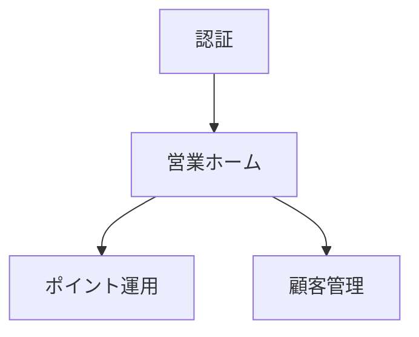

# Screen Documentation Guideline

## 1. Purpose

本ドキュメントは、システム開発における画面設計ドキュメントの管理方式を定義する。

本プロジェクトでは、画面数の増加に伴う画面遷移図の複雑化を防止し、以下を実現することを目的とする。

* 人間による理解容易性の向上
* 生成AIによる解析容易性の向上
* Gitによる差分管理
* ドキュメントの保守性向上
* 機能単位での設計分割
* Featureとのトレーサビリティ確保

本ガイドラインは、画面一覧、画面詳細、画面遷移図の管理方式を定義する正本とする。

---

# 2. 基本方針

## 2.1 画面一覧を正本とする

画面管理の正本は画面一覧とする。

画面遷移図（Mermaid）は正本ではなく、画面一覧および画面詳細から構成される可視化ビューとして扱う。

生成AIは画面追加・変更時に必ず画面一覧を更新しなければならない。

---

## 2.2 全体画面遷移図に全画面を記載しない

全体画面遷移図はシステム全体の構造把握を目的とする。

以下は禁止する。

* 全画面の記載
* 詳細画面までの展開
* 複雑な相互遷移の記載

全体画面遷移図は画面グループ単位で管理する。

---

## 2.3 画面遷移図はグループ単位で作成する

画面遷移図は機能グループ単位で分割する。

例

* 認証
* 営業ホーム
* ポイント運用
* 顧客管理
* クーポン管理
* お知らせ管理
* 分析
* 店舗管理
* アカウント管理

1ファイルに管理する画面数の目安は10〜15画面以内とする。

---

## 2.4 画面詳細は1画面1ファイルとする

画面詳細仕様は画面単位で管理する。

画面遷移図へ画面仕様を記載してはならない。

---

## 2.5 採番規則は別ドキュメントで管理する

画面ID採番規則はプロジェクト固有となるため、本ガイドラインでは定義しない。

画面設計開始時に以下のドキュメントを作成する。

```text
numbering-rule.md
```

採番規則の正本は当該ドキュメントとする。

生成AIは新規画面追加時に必ず採番規則を確認すること。

---

# 3. ディレクトリ構成

```text
docs/
└─ screen/
   ├─ screen-index.md
   ├─ screen-flow-overview.mmd
   │
   ├─ flows/
   │  ├─ auth-flow.mmd
   │  ├─ sales-home-flow.mmd
   │  ├─ point-operation-flow.mmd
   │  └─ ...
   │
   └─ details/
      ├─ S001-splash.md
      ├─ S002-login.md
      ├─ S101-sales-home.md
      └─ ...
```

---

# 4. ドキュメント定義

## 4.1 screen-index.md

### 目的

画面の正本管理

### 管理内容

* 画面ID
* 画面名
* アプリ分類
* 大分類
* 中分類
* 責務
* 最終Feature
* 版数
* 備考

### 例

```markdown
| 画面ID | 画面名 | アプリ分類 | 大分類 | 中分類 | 責務 | 最終Feature | 版数 |
|---------|---------|---------|---------|---------|---------|---------|---------|
| U001 | スプラッシュ | User | 認証 | 起動 | アプリ起動制御 | F-AUTH-001 | v1.0 |
| U002 | ログイン | User | 認証 | ログイン | 認証実行 | F-AUTH-001 | v1.0 |
| U101 | カードケース | User | ホーム | カード | カード一覧表示 | F-CARD-001 | v1.2 |
| S101 | 営業ホーム | Shop | 営業 | ホーム | 営業業務起点 | F-POINT-001 | v1.2 |
```

### アプリ分類

複数アプリを管理するための分類。

例

* User
* Shop
* Admin

### ルール

最終Featureには当該画面を最後に追加または変更したFeatureを記載する。

版数には現在の画面仕様版数を記載する。

---

## 4.3 screen-flow-overview.mmd

### 目的

システム全体構造の把握

### 管理対象

画面ではなく画面グループ

### 例



---

## 4.4 flows/*.mmd

### 目的

機能単位の画面遷移管理

### 管理対象

グループ内の画面遷移

### 原則

* 1ファイル10〜15画面程度
* 他グループへの遷移は代表画面のみ記載
* 他グループ内部構造は記載しない
* 遷移理由を可能な限り明示する

### 例

```mermaid
S201 -->|保存成功| S202
S201 -->|保存失敗| S201
```

---

## 4.5 details/*.md

### 目的

画面仕様管理

### 管理内容

* 画面概要
* 責務
* 関連Feature
* 機能一覧
* 入力項目
* 表示項目
* 状態一覧（State）
* 遷移元
* 遷移先
* 変更履歴

---

# 5. 画面詳細テンプレート

```markdown
# S101 営業ホーム

## 概要

営業業務の起点となるホーム画面

## 責務

営業担当者が日常業務を開始するための入口を提供する

## 関連Feature

- F-HOME-001
- F-POINT-001

## 機能一覧

- ポイント運用遷移
- 顧客管理遷移
- クーポン管理遷移

## State

- 初期表示
- データあり
- データなし
- 通信エラー

## 遷移元

- S002 ログイン

## 遷移先

- S201 ポイントメニュー
- S301 顧客一覧

## 変更履歴

| 版数 | Feature | 変更内容 |
|------|---------|----------|
| v1.0 | F-HOME-001 | 初版作成 |
| v1.1 | F-POINT-001 | ポイント運用導線追加 |
| v1.2 | F-COUPON-001 | クーポン管理導線追加 |
```

---

# 6. Mermaid作成ルール

## 6.1 画面IDを必須とする

良い例

```mermaid
S101[営業ホーム]
```

悪い例

```mermaid
営業ホーム
```

---

## 6.2 画面名変更時もIDは変更しない

画面IDは永続的に利用する。

画面名変更時は名称のみ更新する。

---

## 6.3 他グループは展開しない

良い例

```mermaid
S101 --> S900
```

悪い例

```mermaid
S101 --> S900
S900 --> S301
S900 --> S401
S900 --> S501
```

---

## 6.4 全体図では画面を記載しない

全体図はグループ単位とする。

---

# 7. 生成AIへの指示ルール

画面設計を更新する際、生成AIは以下の順序で更新する。

1. screen-index.md
2. 対象flow.mmd
3. 対象画面詳細

---

画面追加時は必ず以下を実施する。

* 採番規則確認
* 画面ID採番
* 画面一覧更新
* 遷移図更新
* 画面詳細作成

---

画面変更時は必ず以下を実施する。

* 画面一覧の最終Feature更新
* 画面一覧の版数更新
* 対象画面詳細更新
* 変更履歴追加
* 遷移図更新（必要時）

---

画面削除時は必ず以下を実施する。

* 画面一覧削除
* 遷移図修正
* 画面詳細削除

---

# 8. AI開発における基本思想

画面遷移図は正本ではない。

正本は以下とする。

1. screen-index.md
2. details/*.md

Mermaidは人間および生成AIが構造を理解するためのビューとして利用する。

生成AIは画面遷移図のみを信頼せず、必ず画面一覧および画面詳細と整合性を確認しながら設計を行うこと。

---

# 9. トレーサビリティ方針

画面はFeatureと関連付けて管理する。

画面一覧には現在有効な最終Featureを保持する。

変更履歴は各画面詳細に保持する。

これにより以下を追跡可能とする。

```text
Feature
 ↓
Screen
 ↓
Implementation
 ↓
Test
```

また、画面単位で過去の変更理由および変更経緯を確認できる状態を維持する。
