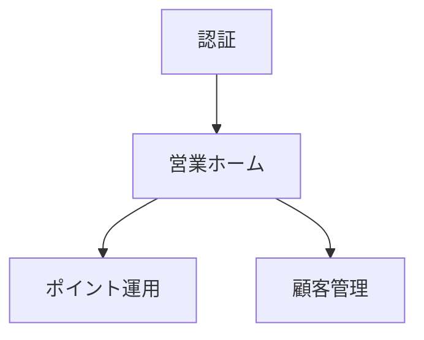

# Screen Documentation Guideline

## 1. Purpose

本ドキュメントは、システム開発における画面設計ドキュメントの管理方式を定義する。

本プロジェクトでは、画面数の増加に伴う画面遷移図の複雑化を防止し、以下を実現することを目的とする。

* 人間による理解容易性の向上
* 生成AIによる解析容易性の向上
* Gitによる差分管理
* ドキュメントの保守性向上
* 機能単位での設計分割

本ガイドラインは、画面仕様書、画面遷移図、画面一覧管理の正本として利用する。

---

# 2. 基本方針

## 2.1 画面一覧を正本とする

画面管理の正本は画面一覧とする。

画面遷移図（Mermaid）は正本ではなく、画面一覧から構成される可視化ビューとして扱う。

生成AIは画面追加・変更時に必ず画面一覧を更新しなければならない。

---

## 2.2 全体画面遷移図に全画面を記載しない

全体画面遷移図はシステム全体の構造把握を目的とする。

以下は禁止する。

* 全画面の記載
* 詳細画面までの展開
* 複雑な相互遷移の記載

全体画面遷移図は画面グループ単位で管理する。

---

## 2.3 画面遷移図はグループ単位で作成する

画面遷移図は機能グループ単位で分割する。

例

* 認証
* 営業ホーム
* ポイント運用
* 顧客管理
* クーポン管理
* お知らせ管理
* 分析
* 店舗設定
* アカウント設定

1ファイルに管理する画面数の目安は10〜15画面以内とする。

---

## 2.4 画面詳細は1画面1ファイルとする

画面詳細仕様は画面単位で管理する。

画面遷移図へ画面仕様を記載してはならない。

---

# 3. ディレクトリ構成

```text
docs/
└─ screen/
   ├─ screen-index.md
   ├─ screen-groups.md
   ├─ screen-flow-overview.mmd
   │
   ├─ flows/
   │  ├─ auth-flow.mmd
   │  ├─ sales-home-flow.mmd
   │  ├─ point-operation-flow.mmd
   │  └─ ...
   │
   └─ details/
      ├─ S001-splash.md
      ├─ S002-login.md
      ├─ S101-sales-home.md
      └─ ...
```

---

# 4. ドキュメント定義

## 4.1 screen-index.md

### 目的

画面の正本管理

### 管理内容

* 画面ID
* 画面名
* 大分類
* 中分類
* 備考

### 例

```markdown
| 画面ID | 画面名 | 大分類 | 中分類 |
|---------|---------|---------|---------|
| S001 | スプラッシュ | 認証 | 起動 |
| S002 | ログイン | 認証 | ログイン |
| S101 | 営業ホーム | 営業 | ホーム |
```

---

## 4.2 screen-groups.md

### 目的

画面グループ管理

### 管理内容

* グループID
* グループ名
* 所属画面

### 例

```markdown
## G03 ポイント運用

- S201 ポイントメニュー
- S211 来店ポイント発行
- S212 買い物ポイント発行
- S213 その他ポイント発行
- S214 ポイント一覧
```

---

## 4.3 screen-flow-overview.mmd

### 目的

システム全体構造の把握

### 管理対象

画面ではなく画面グループ

### 例



---

## 4.4 flows/*.mmd

### 目的

機能単位の画面遷移管理

### 管理対象

グループ内の画面遷移

### 原則

* 1ファイル10〜15画面程度
* 他グループへの遷移は代表画面のみ記載
* 他グループ内部構造は記載しない

---

## 4.5 details/*.md

### 目的

画面仕様管理

### 管理内容

* 画面概要
* 機能一覧
* 入力項目
* 表示項目
* 遷移元
* 遷移先

---

# 5. Mermaid作成ルール

## 5.1 画面IDを必須とする

良い例

```mermaid
S101[営業ホーム]
```

悪い例

```mermaid
営業ホーム
```

---

## 5.2 画面名変更時もIDは変更しない

画面IDは永続的に利用する。

画面名変更時は名称のみ更新する。

---

## 5.3 他グループは展開しない

良い例

```mermaid
S101 --> S900
```

悪い例

```mermaid
S101 --> S900
S900 --> S301
S900 --> S401
S900 --> S501
...
```

---

## 5.4 全体図では画面を記載しない

良い例

```mermaid
Auth --> Home
Home --> Point
```

悪い例

```mermaid
S001 --> S002
S002 --> S101
S101 --> S201
S201 --> S211
...
```

---

# 6. 生成AIへの指示ルール

画面設計を更新する際、生成AIは以下の順序で更新する。

1. screen-index.md
2. screen-groups.md
3. 対象flow.mmd
4. 対象画面詳細

画面追加時は必ず以下を実施する。

* 画面ID採番
* 画面一覧更新
* グループ定義更新
* 遷移図更新
* 画面詳細作成

画面削除時は必ず以下を実施する。

* 画面一覧削除
* グループ定義削除
* 遷移図修正
* 画面詳細削除

---

# 7. AI開発における基本思想

画面遷移図は正本ではない。

正本は画面一覧および画面詳細である。

Mermaidは人間および生成AIが構造を理解するためのビューとして利用する。

生成AIは画面遷移図のみを信頼せず、必ず画面一覧および画面詳細と整合性を確認しながら設計を行うこと。
