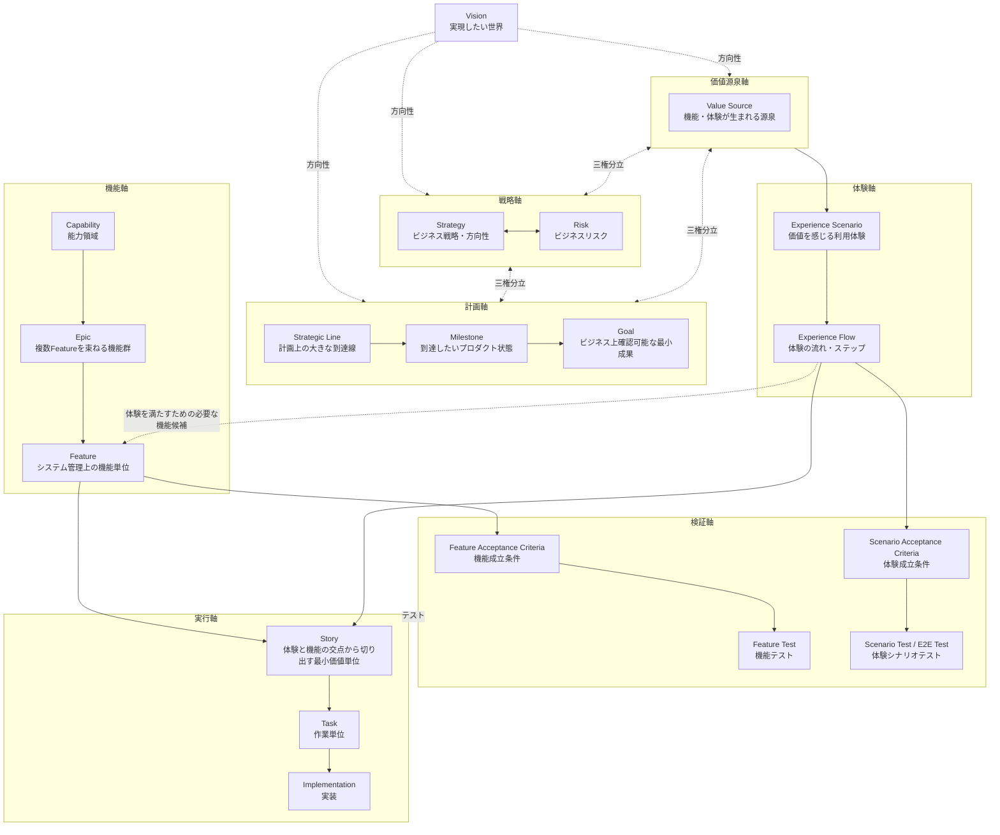
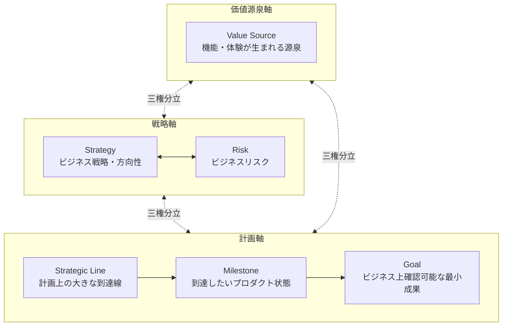
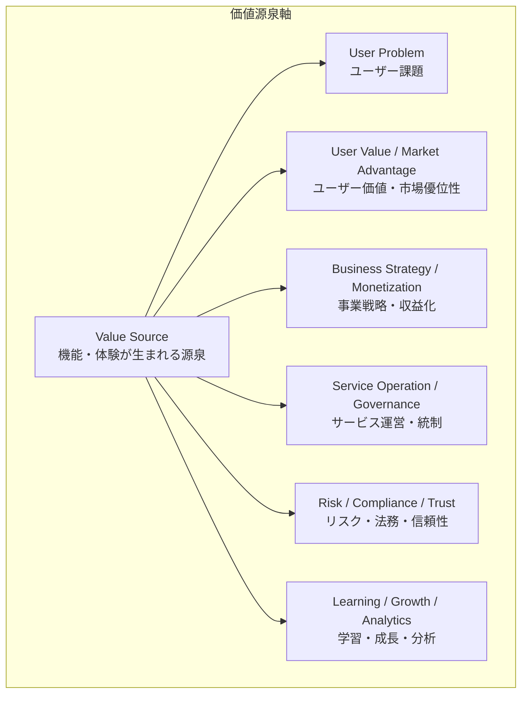

# 価値開発体系

## 全体図

```mermaid

flowchart TB

    V[Vision<br/>実現したい世界]

    subgraph Strategy["戦略軸"]
        STG[Strategy<br/>ビジネス戦略・方向性]
        RSK[Risk<br/>ビジネスリスク]
        STG <--> RSK
    end

    subgraph Schedule["計画軸"]
        TL[Strategic Line<br/>計画上の大きな到達線]
        MiS[Milestone<br/>到達したいプロダクト状態]
        Gol[Goal<br/>ビジネス上確認可能な最小成果]
        TL --> MiS --> Gol
    end

    subgraph ValueSource["価値源泉軸"]
        VS[Value Source<br/>機能・体験が生まれる源泉]
    end

    V -.方向性.-> Strategy
    V -.方向性.-> Schedule
    V -.方向性.-> ValueSource

    Strategy <-.三権分立.-> Schedule
    Schedule <-.三権分立.-> ValueSource
    ValueSource <-.三権分立.-> Strategy

    subgraph Experience["体験軸"]
        ExS[Experience Scenario<br/>価値を感じる利用体験]
        ExF[Experience Flow<br/>体験の流れ・ステップ]
        ExS --> ExF
    end

    ValueSource --> ExS

    subgraph Function["機能軸"]
        Cap[Capability<br/>能力領域]
        EP[Epic<br/>複数Featureを束ねる機能群]
        Ft[Feature<br/>システム管理上の機能単位]
        Cap --> EP --> Ft
    end

    ExF -.体験を満たすための必要な機能候補.-> Ft

    subgraph Verification["検証軸"]
        AcF[Feature Acceptance Criteria<br/>機能成立条件]
        FT[Feature Test<br/>機能テスト]
        AcF --> FT

        AcS[Scenario Acceptance Criteria<br/>体験成立条件]
        ST[Scenario Test / E2E Test<br/>体験シナリオテスト]
        AcS --> ST
    end

    subgraph Execution["実行軸"]
        S[Story<br/>体験と機能の交点から切り出す最小価値単位]
        T[Task<br/>作業単位]
        I[Implementation<br/>実装]
        S --> T --> I
    end

    Ft --> S
    Ft --> AcF

    ExF --> S
    ExF --> AcS

    Verification <-.テスト.-> Execution

```
## エリア別詳細

### 三権分立

```mermaid
flowchart TB
    subgraph Strategy["戦略軸"]
        STG[Strategy<br/>ビジネス戦略・方向性]
        RSK[Risk<br/>ビジネスリスク]
        STG <--> RSK
    end

    subgraph Schedule["計画軸"]
        TL[Strategic Line<br/>計画上の大きな到達線]
        MiS[Milestone<br/>到達したいプロダクト状態]
        Gol[Goal<br/>ビジネス上確認可能な最小成果]
        TL --> MiS --> Gol
    end

    subgraph ValueSource["価値源泉軸"]
        VS[Value Source<br/>機能・体験が生まれる源泉]
    end

    Strategy <-.三権分立.-> Schedule
    Schedule <-.三権分立.-> ValueSource
    ValueSource <-.三権分立.-> Strategy

```
#### 戦略軸

```mermaid
flowchart TB
```

#### 計画軸

```mermaid
flowchart TB
```

#### 価値軸

```mermaid
flowchart TB
    subgraph ValueSource["価値源泉軸"]
        VS[Value Source<br/>機能・体験が生まれる源泉]

        UP[User Problem<br/>ユーザー課題]
        UV[User Value / Market Advantage<br/>ユーザー価値・市場優位性]
        BM[Business Strategy / Monetization<br/>事業戦略・収益化]
        SG[Service Operation / Governance<br/>サービス運営・統制]
        RT[Risk / Compliance / Trust<br/>リスク・法務・信頼性]
        LA[Learning / Growth / Analytics<br/>学習・成長・分析]

        VS --> UP
        VS --> UV
        VS --> BM
        VS --> SG
        VS --> RT
        VS --> LA
    end	
```
